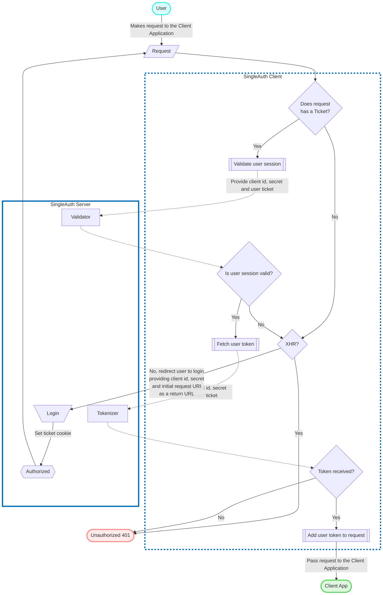

<h1 class="s-header">
  
</h1>

??? quote "RFC 2119"

    The key words "MUST", "MUST NOT", "REQUIRED", "SHALL", "SHALL NOT", "SHOULD", "SHOULD NOT",
    "RECOMMENDED",  "MAY", and "OPTIONAL" in this document are to be interpreted as described in
    RFC 2119.

SingleAuth is a lightweight authentication framework which makes able to organize an interaction
between an authentication server, client application and end user in such a way that the user only
need to log in once, and then the server and client can interact on their own. And even more: any
client application using the same authentication server for access protection will be able to
interact with the server without any additional user actions: user request to the client will be
enough.

Therefore, the SingleAuth based authentication server meets the "Single Sign-On" concept from the
user's perspective.

## Features

SingleAuth based server must implement the following features.

* Authentication system: processing login and logout user requests and providing a special
  [_ticket_](#ticket) cookie.
* User session verification by the _ticket_.
* User token generation by the _ticket_ (if user session is valid).

!!! info "About SingleAuth features"

    Feature is an ability of an authentication server to make done some certain bounded task. In
    addition to the mandatory features listed above, specific SingleAuth based solution can
    implement additional features. In particular, SingleA has an additional
    [Request Signature](features/signature.md) and
    [Payload Fetcher](features/payload-fetcher.md) features.

SingleAuth framework does not oblige the client to use all the features. Every client decides what
features to use, but particular SingleAuth implementation may have its own rules and demands.

### Client registration

Every request from a client application or end user to the SingleAuth server must be made with
providing a unique client identifier and a secret, which makes it possible to distinguish requests
from different clients and process them correctly. For this reason the server must provide the
client registration method.

The basic registration method should be implemented as an endpoint for POST requests. A valid
registration request should contain a JSON formatted data. Successful response must contain the
client id and secret, and may contain additional data. All this data should be JSON formatted.

A particular SingleAuth implementation may restrict client registration according to its business
logic.

### Ticket

Ticket is a core of the SingleAuth framework. It is a unique user identifier which allows the
SingleAuth client to interact with an authentication server on behalf of the user. The ticket must
be provided to the user in a corresponding cookie, which `Domain` attribute must be matchable with
all the client applications using the same SingleAuth server. For example, if you have 2
applications working on app1.domain.org and app2.domain.org, and a SingleAuth instance on
sso.domain.org, the ticket cookie must be provided with `Domain=domain.org` attribute. This will
allow to pass the given ticket in every user request to client applications.

## SingleAuth flow

First the client application must be registered on the SingleAuth server side in any available way.
Afterwards, the client id and secret must be included in every request between the SingleAuth server
and client application or end user.

When the user doing the very first request to any client application protected by the SingleAuth
server, authentication has not been performed yet and user session does not exist. So the ticket
cookie does not exist too and the user must be logged in.

!!! warning ""

    If the processing request is an XHR request it's processing must be immediately finished with an
    HTTP error **Unauthorized 401**.

After successful authorization the user should be redirected to the initial request URI with
preservation of query parameters. The redirect response must contain a ticket cookie, which will be
used further to interact between the SingleAuth client and server without user participation.

If the request being processed contains the ticket cookie, the SingleA client validates the user
session by an internal request to the SingleA server included the ticket value. If the validation
was failed, the behavior is the same as if the ticket does not exist.

After confirming the validity of the user session the SingleA client can fetch user token by an
internal request to the server (included the ticket value). If the token was successfully received,
it appends to the initial request into the header `Authorization` and the request passes to the
client application for further processing. Otherwise, an HTTP error **Unauthorized 401** must be
returned.

!!! info

    As noted above, it is not necessary to use every SingleA server features (user authentication,
    user session validation and user token generation). The client application may need only certain
    features, e.g. user session validation without fetching the user token, or fetching the user
    token without redirect the user to the login process.

### Flowchart

## Inspired by

The creation of the SingleAuth framework was inspired by such well-known and reliable protocols as:

* [OAuth 2.0](https://oauth.net/2/) and [OpenID Connect](https://openid.net/connect/)
* [CAS](https://apereo.github.io/cas/6.5.x/protocol/CAS-Protocol-Specification.html)
* [Kerberos](http://web.mit.edu/kerberos/krb5-current/doc/)

